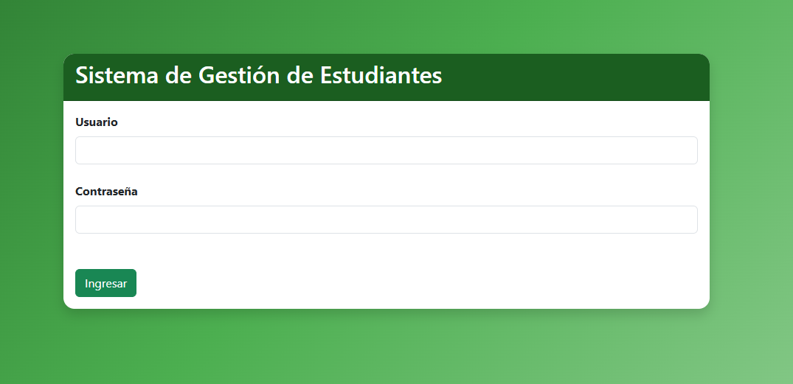
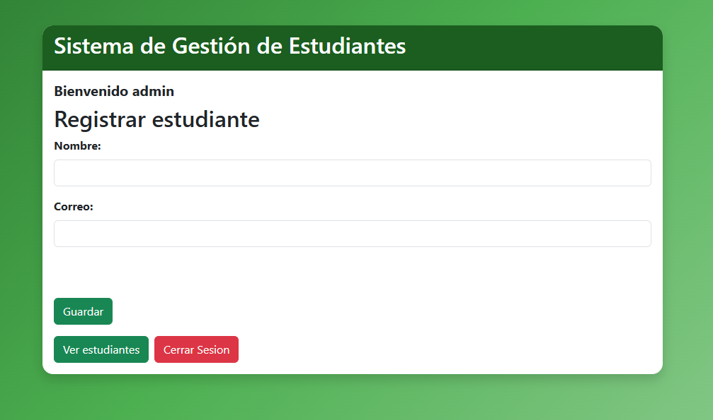
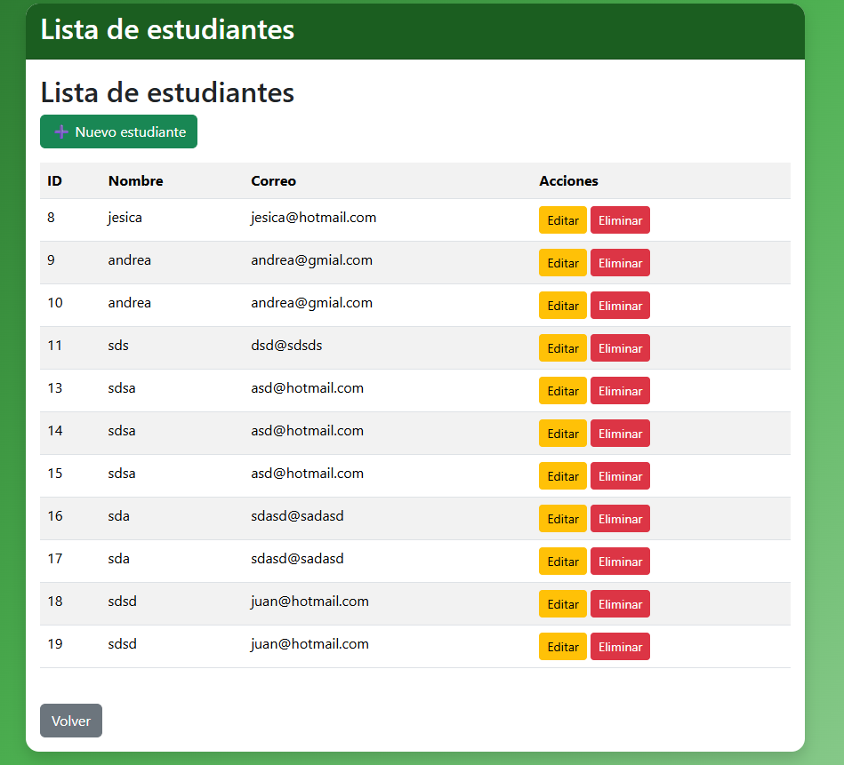
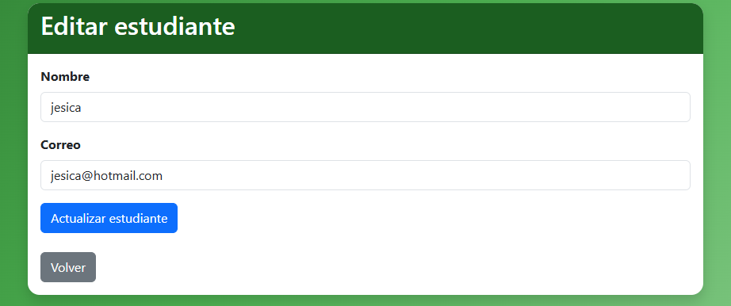
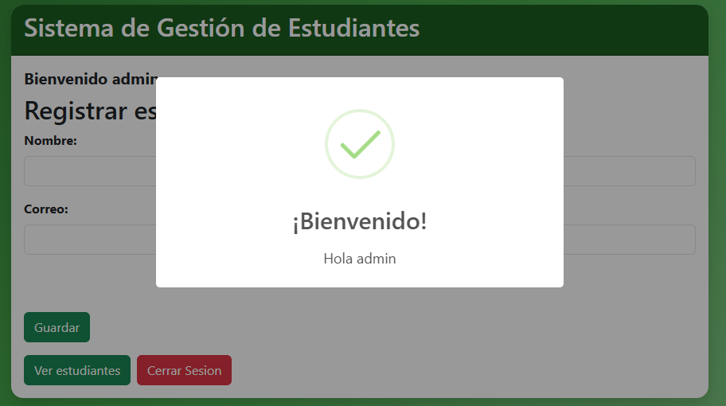
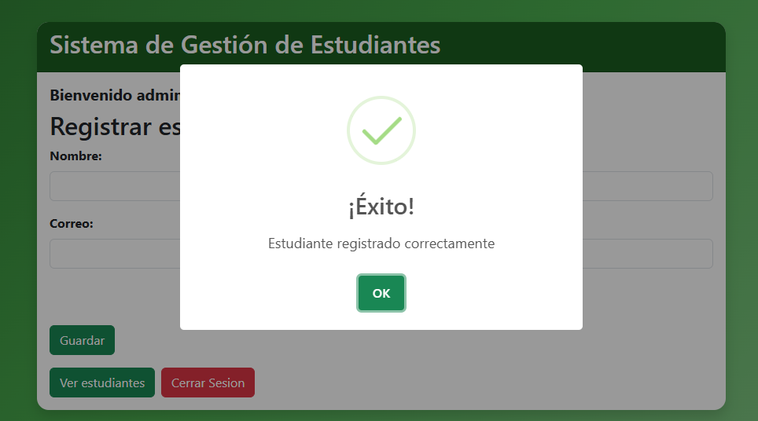
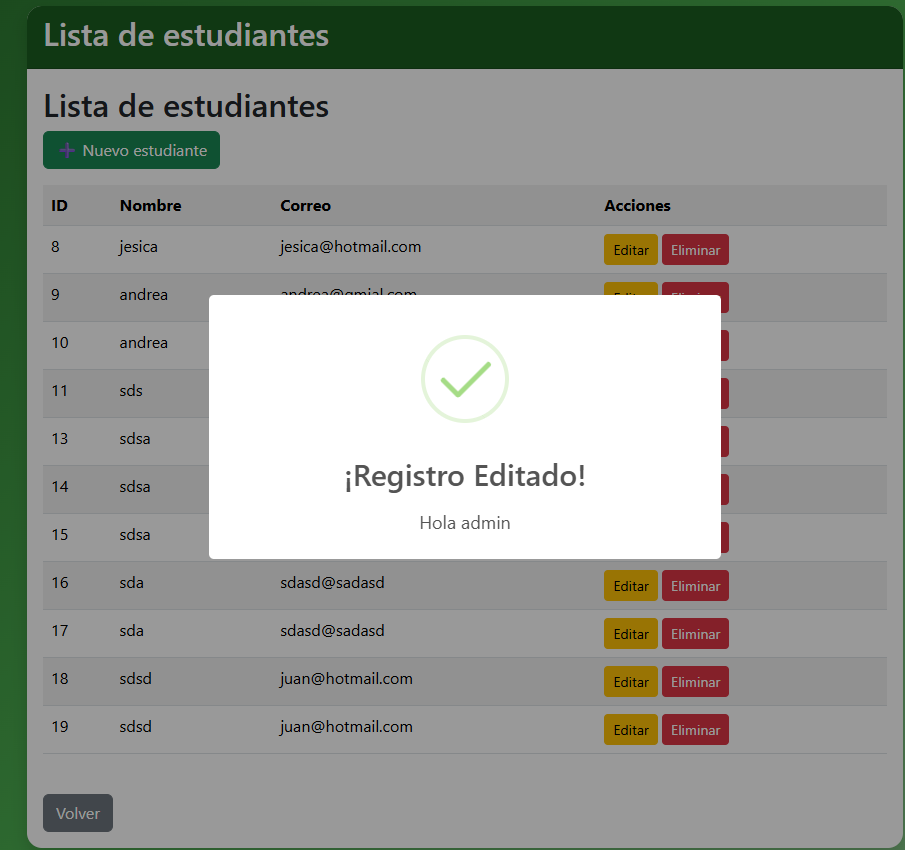
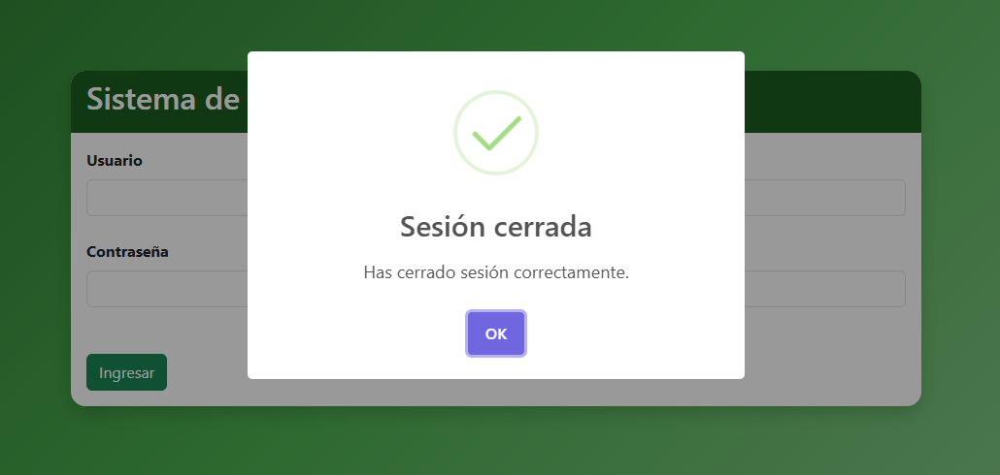

# Sistema de Gestión de Estudiantes

## Descripción

Sistema web desarrollado en PHP para la gestión de estudiantes. Permite iniciar sesión, registrar, editar, eliminar y visualizar estudiantes.

## Tecnologías

- PHP
- MySQL
- Docker
- Bootstrap 5
- SweetAlert2
- HTML5
- CSS3

## Funcionalidades

- Inicio de sesión
- Registro de estudiantes
- Listado de estudiantes
- Edición
- Eliminación
- Cierre de sesión
- Mensajes con SweetAlert

## Capturas

## Capturas

### Login



### Inicio



### Listado



### Editar



### SweetAlert - Login



### SweetAlert - Guardar



### SweetAlert - Editar



### SweetAlert - Cerrar sesión



## Cómo ejecutar el proyecto

1. Clonar el repositorio.
2. Ejecutar:

```bash
docker-compose up --build

http://localhost:8080


Autor
Steven Bolívar

```bash
git add .
git commit -m "Versión final del sistema de gestión de estudiantes"
git push origin main